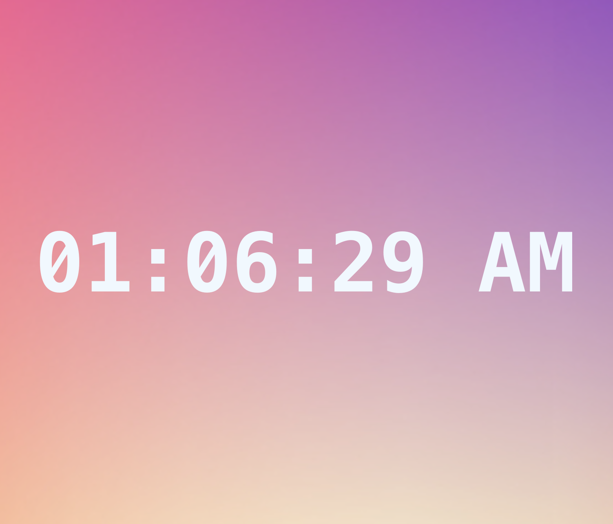
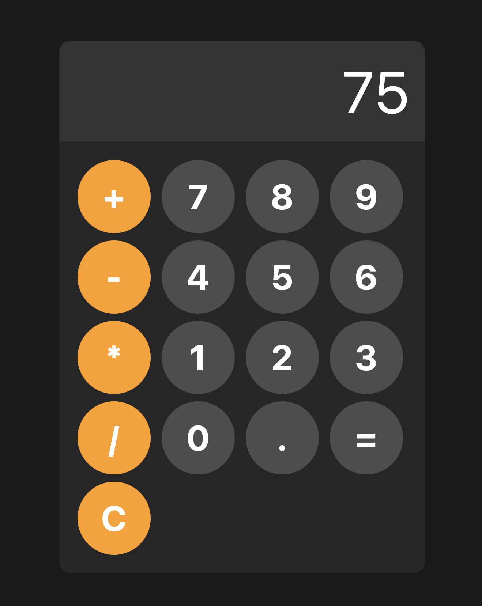

# Weather Web
### Display worldwide weather information include city, temperature, humidity, and weather emoji.

[Weather web](https://chris00234.github.io/full_stack/weather_web/)

# Current Time
### Display Current time.

[Digital Clock](https://chris00234.github.io/full_stack/digittal_clock/)

# Stop Watch
### Stop watch features.

[StopWatch](https://chris00234.github.io/full_stack/stopwatch/)

# Rock-Paper-Scissors
### You can play rock-paper-scissors game!

[Rock-Paper-Scissors Game](https://chris00234.github.io/full_stack/rock_paper_scissor/)

# Calculator
### Basic features of calculator

[Calculator](https://chris00234.github.io/full_stack/calculator/)

# pokemon API
### Search any pokemon to generate illustration

[pokemon search](https://chris00234.github.io/full_stack/pokemon_api/)
